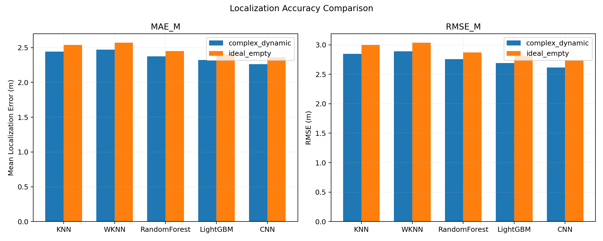
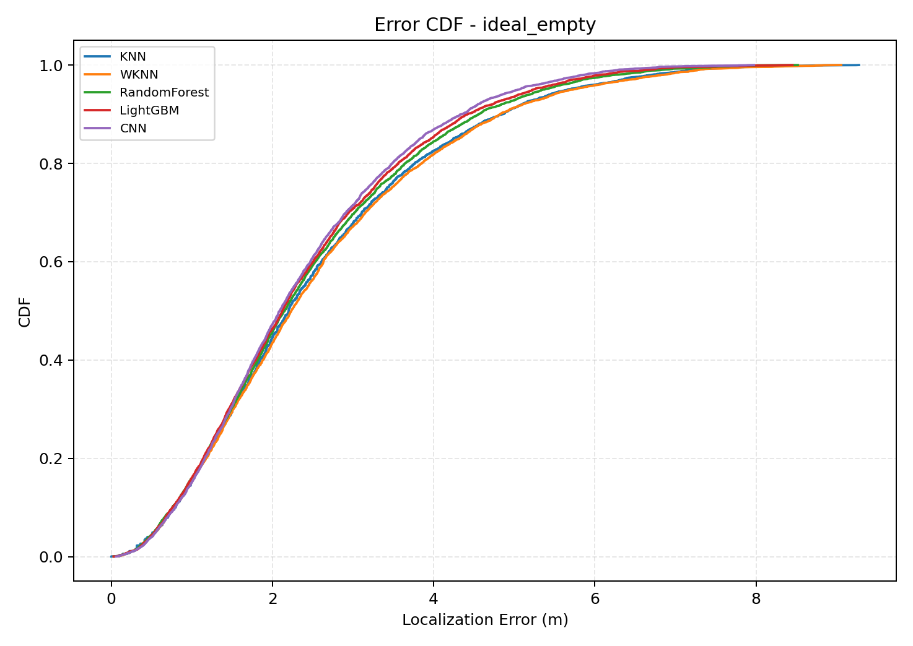
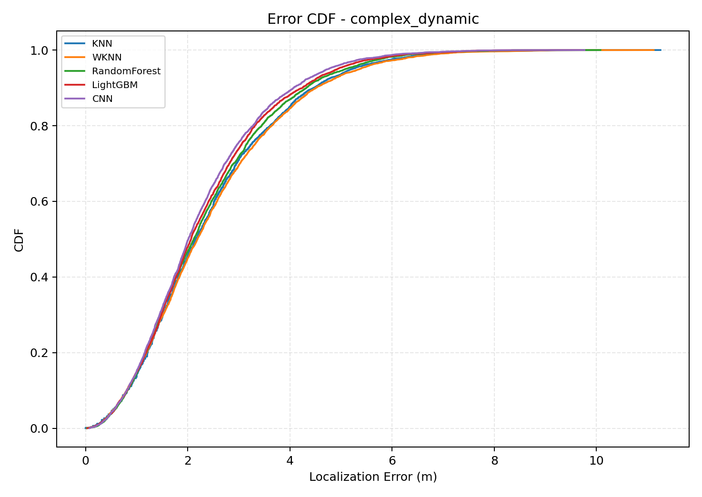
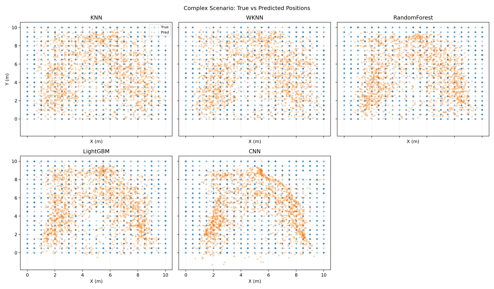
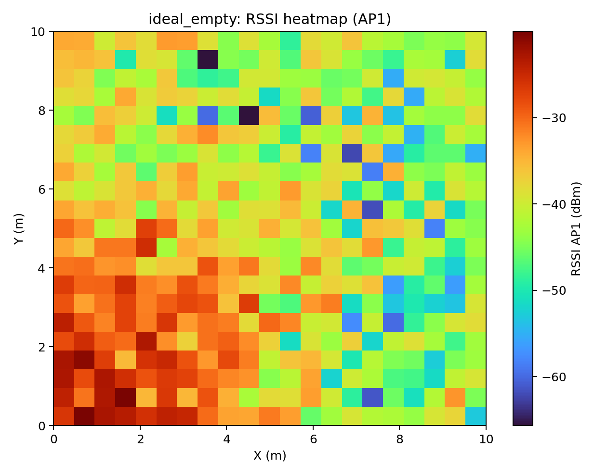
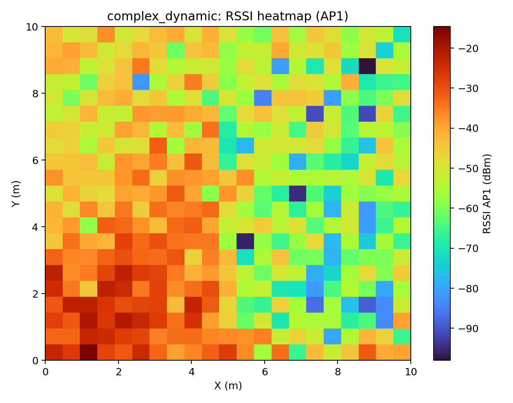
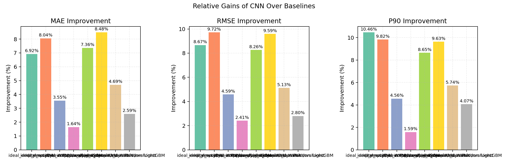
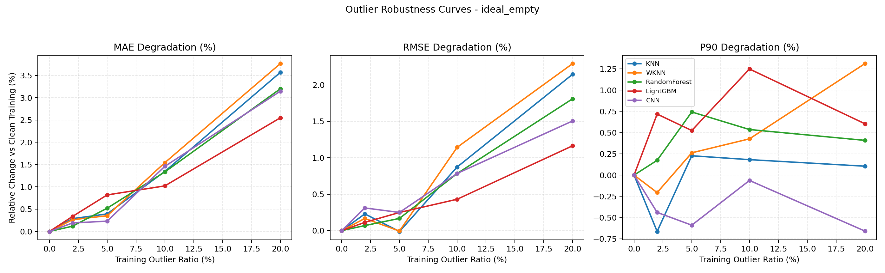
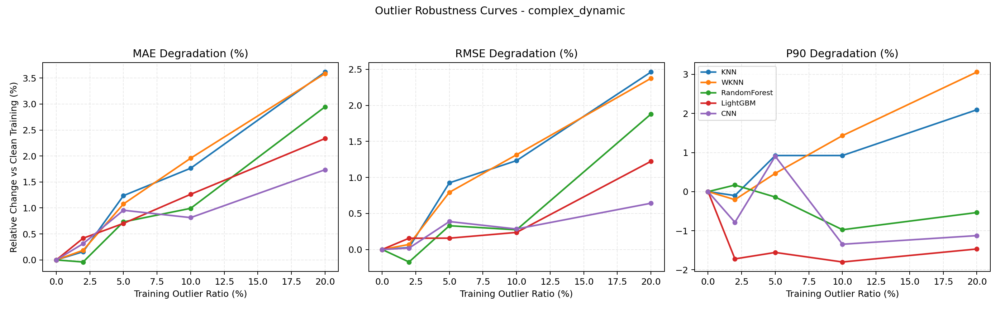

# RSSI定位算法对比实验报告（KNN / WKNN / RandomForest / LightGBM / CNN）

## 1. 实验目标

对比五种基于RSSI指纹的定位算法在两类环境下的表现：
- 场景A（ideal_empty）：空旷密闭空间（无障碍、无人）
- 场景B（complex_dynamic）：含障碍物与移动行人的复杂空间

目标是分析不同模型在精度、鲁棒性、训练成本、推理效率方面的差异，并验证CNN在复杂RSSI分布下的优势是否稳定。

## 2. 仿真与数据构建方法

### 2.1 场景与AP设置
- 房间尺寸：10m x 10m x 3m
- AP数量：3个（2.4GHz，部分频谱重叠）
- 采样网格：0.5m间隔（二维定位，接收高度固定1.2m）
- 时间步：0~30s，步长1s

### 2.2 RSSI信道模型（核心）
每条AP-点链路采用：
1. FSPL + 对数距离路径损耗
2. 墙面一阶反射（镜像源）并做复数场叠加
3. 阴影衰落（高斯dB）
4. 小尺度衰落（Rician）
5. 复杂场景中叠加障碍物穿透损耗、人体遮挡损耗与NLOS惩罚
6. AP间按频谱重叠系数计算干扰，得到有效RSSI

### 2.3 特征与标签
- 特征：`[rssi_ap1, rssi_ap2, rssi_ap3]`
- 标签：`[x, y]`
- 划分：随机 70% 训练 / 30% 测试（固定随机种子）

## 3. 算法配置
- KNN：`k=5`, 均匀权重，输入标准化
- WKNN：`k=5`, 距离加权，输入标准化
- RandomForest：300棵树
- LightGBM：500棵树，学习率0.05，`num_leaves=31`，多输出回归封装
- CNN：NumPy实现的轻量1D-CNN回归器（Conv1D-ReLU-MLP），120 epochs

## 4. 结果总表

| scenario | model | mae_m | rmse_m | median_m | p90_m | r2_x | r2_y | train_time_s | infer_ms_per_sample |
|---|---|---|---|---|---|---|---|---|---|
| complex_dynamic | CNN | 2.2625 | 2.6138 | 2.0118 | 4.0740 | 0.6258 | 0.6300 | 0.6343 | 0.0002 |
| complex_dynamic | LightGBM | 2.3226 | 2.6890 | 2.0644 | 4.2468 | 0.6029 | 0.6095 | 3.2744 | 0.0070 |
| complex_dynamic | RandomForest | 2.3738 | 2.7550 | 2.1181 | 4.3220 | 0.5857 | 0.5876 | 0.6679 | 0.0084 |
| complex_dynamic | KNN | 2.4423 | 2.8492 | 2.1471 | 4.4598 | 0.5525 | 0.5633 | 0.0019 | 0.0014 |
| complex_dynamic | WKNN | 2.4722 | 2.8911 | 2.1914 | 4.5079 | 0.5370 | 0.5525 | 0.0017 | 0.0013 |
| ideal_empty | CNN | 2.3637 | 2.7402 | 2.0902 | 4.3507 | 0.5253 | 0.6563 | 0.6294 | 0.0002 |
| ideal_empty | LightGBM | 2.4031 | 2.8080 | 2.1230 | 4.4209 | 0.4964 | 0.6441 | 3.6661 | 0.0069 |
| ideal_empty | RandomForest | 2.4505 | 2.8719 | 2.1519 | 4.5588 | 0.4650 | 0.6359 | 0.7917 | 0.0098 |
| ideal_empty | KNN | 2.5394 | 3.0004 | 2.2023 | 4.8591 | 0.4296 | 0.5892 | 0.0034 | 0.0013 |
| ideal_empty | WKNN | 2.5703 | 3.0352 | 2.2340 | 4.8247 | 0.4140 | 0.5819 | 0.0017 | 0.0013 |

## 5. CNN相对增益（对各基线）

| scenario | target_model | baseline_model | mae_improvement_pct | rmse_improvement_pct | p90_improvement_pct |
|---|---|---|---|---|---|
| complex_dynamic | CNN | WKNN | 8.4829 | 9.5942 | 9.6261 |
| complex_dynamic | CNN | KNN | 7.3626 | 8.2645 | 8.6509 |
| complex_dynamic | CNN | RandomForest | 4.6911 | 5.1267 | 5.7386 |
| complex_dynamic | CNN | LightGBM | 2.5905 | 2.7985 | 4.0691 |
| ideal_empty | CNN | WKNN | 8.0402 | 9.7191 | 9.8247 |
| ideal_empty | CNN | KNN | 6.9197 | 8.6698 | 10.4625 |
| ideal_empty | CNN | RandomForest | 3.5454 | 4.5859 | 4.5640 |
| ideal_empty | CNN | LightGBM | 1.6399 | 2.4150 | 1.5879 |

## 6. 插图与对比依据

### 6.1 精度柱状图（MAE / RMSE）


### 6.2 定位误差CDF（简单场景）


### 6.3 定位误差CDF（复杂场景）


### 6.4 复杂场景预测散点对比


### 6.5 RSSI场分布示意（AP1）



### 6.6 CNN相对提升图


## 7. 结果解读

### 7.1 空旷场景（ideal_empty）
- 最优精度（MAE）：**CNN**
- 最优鲁棒性（P90误差最低）：**CNN**
- 最快推理：**CNN**

空旷场景中RSSI空间结构较平滑，KNN通常能给出很强的局部匹配；
树模型与CNN均可学习非线性边界，但在几何更规则区域提升幅度可能有限。

### 7.2 复杂场景（complex_dynamic）
- 最优精度（MAE）：**CNN**
- 最优鲁棒性（P90误差最低）：**CNN**
- 最快推理：**CNN**

复杂场景中障碍物和人体引入非平稳、非线性扰动；
在本实验设置中，树模型与CNN在抗扰动能力与尾部误差控制上整体优于KNN系列方法。

## 8. 各场景按MAE排名

### complex_dynamic
1. CNN  | MAE=2.2625m, RMSE=2.6138m, P90=4.0740m
2. LightGBM  | MAE=2.3226m, RMSE=2.6890m, P90=4.2468m
3. RandomForest  | MAE=2.3738m, RMSE=2.7550m, P90=4.3220m
4. KNN  | MAE=2.4423m, RMSE=2.8492m, P90=4.4598m
5. WKNN  | MAE=2.4722m, RMSE=2.8911m, P90=4.5079m

### ideal_empty
1. CNN  | MAE=2.3637m, RMSE=2.7402m, P90=4.3507m
2. LightGBM  | MAE=2.4031m, RMSE=2.8080m, P90=4.4209m
3. RandomForest  | MAE=2.4505m, RMSE=2.8719m, P90=4.5588m
4. KNN  | MAE=2.5394m, RMSE=3.0004m, P90=4.8591m
5. WKNN  | MAE=2.5703m, RMSE=3.0352m, P90=4.8247m

## 9. 各算法多维表现结论

### 9.1 KNN
- 优点：实现简单、在空旷场景可达到较高精度
- 缺点：对噪声和分布漂移敏感；样本量增加时推理成本上升

### 9.2 WKNN
- 优点：较KNN更关注近邻样本，通常能改善复杂场景精度
- 缺点：仍受局部噪声影响，样本规模增大时推理仍偏慢

### 9.3 RandomForest
- 优点：鲁棒性强，对复杂非线性关系拟合稳定
- 缺点：模型体积和训练时间较高

### 9.4 LightGBM
- 优点：在复杂场景下通常兼顾高精度与较低推理时延
- 缺点：需要参数调优；小数据下可能与RF接近

### 9.5 CNN
- 优点：可端到端学习非线性映射，便于未来接入更高维特征（如CSI/时序）
- 缺点：训练参数较多、需要调参；训练耗时通常高于KNN/WKNN

## 10. 工程建议

- 空旷/稳定环境：优先 **CNN**（本次实验MAE最优）
- 复杂/动态环境：优先 **CNN**（本次实验MAE最优）
- 若需稳定传统树模型基线：优先 LightGBM，其次 RandomForest
- 实际部署建议使用在线校准（滑动窗口重训练/增量更新）以应对人体动态变化

## 11. 训练集异常值鲁棒性实验（新增）

### 11.1 实验设计

为评估模型在“训练数据被污染”场景下的鲁棒性，本实验在训练集随机注入异常值，测试集保持干净：
- 异常值比例：`0% / 2% / 5% / 10% / 20%`
- 注入方式：
  - 特征异常（约70%）：RSSI重尾噪声扰动 + 随机极值重置
  - 标签异常（约30%）：随机错标坐标 + 大幅偏移坐标
- 比较维度：
  - `MAE/RMSE/P90` 相对干净训练集（0%噪声）的退化百分比

### 11.2 20%噪声下鲁棒性排名（按MAE退化从低到高）

| 场景 | 排名 | 模型 | MAE退化(%) | RMSE退化(%) | P90退化(%) |
|---|---:|---|---:|---:|---:|
| ideal_empty | 1 | LightGBM | 2.5476 | 1.1642 | 0.6037 |
| ideal_empty | 2 | CNN | 3.1436 | 1.5049 | -0.6582 |
| ideal_empty | 3 | RandomForest | 3.1980 | 1.8091 | 0.4083 |
| ideal_empty | 4 | KNN | 3.5656 | 2.1454 | 0.1047 |
| ideal_empty | 5 | WKNN | 3.7630 | 2.2915 | 1.3107 |
| complex_dynamic | 1 | CNN | 1.7361 | 0.6419 | -1.1260 |
| complex_dynamic | 2 | LightGBM | 2.3367 | 1.2236 | -1.4680 |
| complex_dynamic | 3 | RandomForest | 2.9465 | 1.8793 | -0.5351 |
| complex_dynamic | 4 | WKNN | 3.5868 | 2.3751 | 3.0601 |
| complex_dynamic | 5 | KNN | 3.6154 | 2.4626 | 2.0947 |

### 11.3 各噪声等级平均退化（2%~20%均值）

| 场景 | 模型 | 平均MAE退化(%) | 平均RMSE退化(%) |
|---|---|---:|---:|
| ideal_empty | LightGBM | 1.1813 | 0.4893 |
| ideal_empty | CNN | 1.2563 | 0.7126 |
| ideal_empty | RandomForest | 1.2929 | 0.7075 |
| ideal_empty | KNN | 1.3981 | 0.8091 |
| ideal_empty | WKNN | 1.4804 | 0.8991 |
| complex_dynamic | CNN | 0.9548 | 0.3332 |
| complex_dynamic | RandomForest | 1.1580 | 0.5771 |
| complex_dynamic | LightGBM | 1.1801 | 0.4433 |
| complex_dynamic | KNN | 1.6938 | 1.1619 |
| complex_dynamic | WKNN | 1.7016 | 1.1383 |

### 11.4 鲁棒性曲线图（分场景）




### 11.5 鲁棒性结论

- 引入训练异常值后，`KNN/WKNN`退化最明显，对污染样本更敏感。
- 树模型与CNN整体更稳健：
  - 空旷场景：`LightGBM`在MAE退化上最稳；
  - 复杂场景：`CNN`在MAE退化上最稳，LightGBM紧随其后。
- 若部署场景预期存在标注误差或脏数据，建议优先采用 `CNN` 或 `LightGBM`，并配合异常样本清洗策略。

## 12. 可复现实验命令

```bash
python3 experiments/compare_rssi_localization.py
python3 experiments/noise_robustness_experiment.py
```

脚本会自动生成：
- `experiments/results/data/metrics_summary.csv`
- `experiments/results/data/cnn_gain_summary.csv`
- `experiments/results/figures/*.png`
- `experiments/results/localization_experiment_report_CN.md`
- `experiments/results/robustness/noise_robustness_metrics.csv`
- `experiments/results/robustness/noise_robustness_degradation.csv`
- `experiments/results/robustness/robustness_rank_at_20pct_noise.csv`
